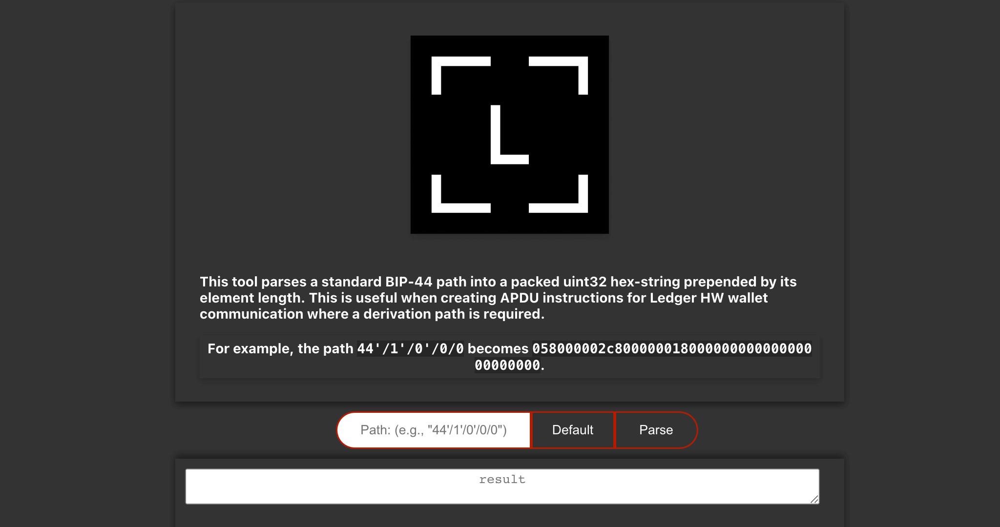

# Ledger-BIP-44-Path-Tool

This tool parses a standard BIP-44 path into a packed uint32 hex-string prepended by its element length. This is useful when creating APDU instructions for Ledger HW wallet communication where a derivation path is required.

* [https://ledger-bip-44-path-tool.vercel.app](https://ledger-bip-44-path-tool.vercel.app)
* [https://replit.com/@sleepdefic1t/Ledger-BIP-44-Path-Tool](https://replit.com/@sleepdefic1t/Ledger-BIP-44-Path-Tool?v=1)

